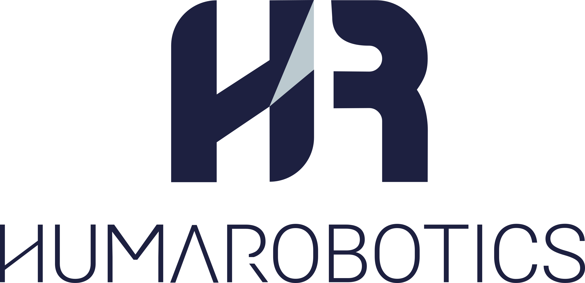

# Doosan SensoPart

  <a href="./README.md">English</a> •
  <a href="docs/README-fr.md">Français</a>

--------------

Interface to use a SensoPart camera with a Doosan robot

This project is developed by [HumaRobotics](https://www.humarobotics.com/).

## Requirements

- A **Doosan robot**
- A **SensoPart** camera

## How to use

- Create a `Custom Code` and import the [DoosanSensoPart.py](./DoosanSensoPart.py) file (replace .py by .txt to import in the Doosan). Don't forget to remove first lines of the code (those lines are used to test the code without a robot).

- Then, look at the examples in the "examples" folder to see how to use the DoosanSensoPart class. You can begin with the [ex_basic.py](./examples/ex_basic.py) (don't forget to change the extension '.py' to '.txt' before importing it into the Doosan). In this example, the trame need to be: `score;posx;posy;angle`. But you can adapt the trame to your project by modifying the *extract_data* function of DoosanSensoPart class.

## Robot calibration

In order to calibrate the camera with the Doosan, please refer to chapter **8.1.5.3.1Calibration,Grilledecalibration(Robotique)** page 94 of [Visor_user_manual_fr.pdf](./documentations/VISOR_user_manual_fr.pdf).

Please look at the [ex_hand_eye_calibration.py](./examples/ex_hand_eye_calibration.py) if you need to performed a robotic hand eye calibration.

## Examples files

- [ex_basic.py](./examples/ex_basic.py): Basic example for the communication between SensoPart camera and Doosan robot using Task Writer.

- [ex_hand_eye_calibration.py](./examples/ex_hand_eye_calibration.py): Use to perform a robotic hand eye calibration

## Tests files

- [test_fake_sensopart.py](./tests/test_fake_sensopart.py): Code made to simulate a SensoPart camera from a computer. You can run this script and then the [DoosanSensoPart.py](./DoosanSensoPart.py) program in the same computer to simulate a communication.

