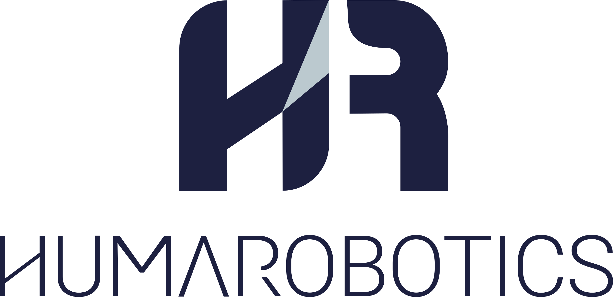

# Doosan SensoPart

  <a href="../README.md">English</a> •
  <a href="./README-fr.md">Français</a>

--------------

Interface permettant d'utiliser une caméra SensoPart avec un robot Doosan

Ce projet est développé par [HumaRobotics](https://www.humarobotics.com/).

## Conditions requises

- Un **Doosan robot**
- Une camera **SensoPart**

## Mode d'emploi

- Créez un `Custom Code` et importez le fichier [DoosanSensoPart.py](./DoosanSensoPart.py) (il faut remplacer le .py par .txt pour importer le fichier dans un Doosan). N'oubliez pas d'enlever les premières lignes du code (ces lignes sont utilisées pour tester le code sans robot).

- Ensuite, regardez les exemples dans le dossier "examples" pour voir comment utiliser la classe DoosanSensoPart. Vous pouvez commencer avec le programme [ex_basic.py](./examples/ex_basic.py) (n'oubliez pas de changer l'extension '.py' en '.txt' pour importer le fichier dans le Doosan). Dans cet exemple, la trame de données doit-être `score;posx;posy;angle`. Vous pouvez cependant adapter cette trame à votre projet en modifiant la fonction *extract_data* de la classe DoosanSensoPart.

## Calibration robot

Pour calibrer la caméra avec le Doosan, réferez vous au chapitre **8.1.5.3.1Calibration,Grilledecalibration(Robotique)** page 94 de la documentation [Visor_user_manual_fr.pdf](./documentations/VISOR_user_manual_fr.pdf).

Pour procéder à une calibration *Hand eye*, veuillez regarder l'exemple [ex_hand_eye_calibration.py](./examples/ex_hand_eye_calibration.py).

## Exemples

- [ex_basic.py](./examples/ex_basic.py): Exemple basique de communication entre une caméra SensoPart et un robot Doosan.

- [ex_hand_eye_calibration.py](./examples/ex_hand_eye_calibration.py): Exemple permettant de procéder à une calibration *Hand Eye*.

## Tests

- [test_fake_sensopart.py](./tests/test_fake_sensopart.py): Code simulant une caméra SensoPart depuis un ordinateur. Vous pouvez lancer ce script, puis le programme [DoosanSensoPart.py](./DoosanSensoPart.py) depuis un même ordinateur pour simuler la communication.

